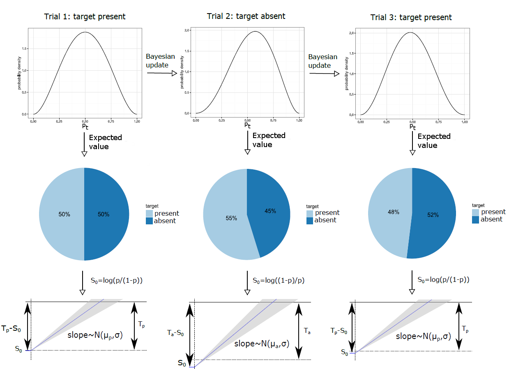

# Dynamic Bayesian updating and inter-trial effects

## Factorial comparison of multiple updating models

To identify the origins of the observed inter-trial effects, we systematically compared multiple computational models using the factorial comparison method [@van_den_berg_factorial_2014]. Given that both the DDM and the LATER model provide a good prediction of the RT distributions, we consider the model of RT distributions as one factor (DDM vs. LATER). 

Both models have same parameters: the evidence accumulation rate ($r$), the initial starting point ($S_0$), and the decision threshold ($\theta$). In addition, the DDM model has one further parameter:  non-decision time ($T_{er}$). Here we also added a non-decision time parameter to the LATER model, and considered the presence vs. absence of a non-decision time as one factor (i.e., non-decision time fixed to zero vs. non-decision time as a free parameter). 

One of the main purposes of the model comparison was to investigate through what mechanisms response history and the history of the target dimension influence RTs. To this end, we  consider the influence of the history of the response-defining feature (RDF) and the target-defining dimension (TDD) on updating of the parameters of the RT distribution model as two factors. For each factor, we consider six different forms of updating (factor levels). 

__Level 1 (No update)__: RDF/TDD repetition/switch does not affect any model parameters. 

__Level 2 ($S_0$ with full memory)__: RDF/TDD repetition/switch updates the initial starting point ($S_0$) according to the whole prior history. As suggested by @carpenter_neural_1995 and @gold_neural_2007, $S_0$ is determined by the log prior odds of two decision outcomes ($H$ vs. $\sim H$): 

<p>
\begin{equation}
\beta = log \frac{P(H)}{1- P(H)} 
 (\#eq:logprior)
\end{equation}
</p>

Here we assume the prior probability $P(H)$, rather than being fixed, is updated trial-wise according to Bayesian inference. Thus, the posterior of the prior is:

<p>
\begin{equation}
P(H_t | X_t) \propto P(X_t | H_t) P(H_t) 
 (\#eq:bayesrule)
\end{equation}
</p>

This updating can be modeled by using a Beta distribution as the starting distribution on the prior (a hyperprior) and updating after each trial using the Bernoulli likelihood. We assume that participants were unbiased at the beginning of the experiment (i.e., the two parameters of the Beta distribution initially had the same value $\beta$) and gradually updated their prior based on the trial history. Figure \@ref(fig:betaUpdate) illustrates the updating.

```{r betaUpdate, out.width='75%', ,fig.cap="Schematic illustration of prior updating and the resulting changes of the starting point. The top row shows the hyperprior, that is, the probability distribution on the frequency of target present trials ($p$), and how it changes over three subsequent trials. The middle row shows the current best estimate of the frequency distribution over target-present and -absent trials (i.e., $p$ and $1-p$). The best estimate of $p$ is defined as the expected value of the hyperprior. The bottom row shows a sketch of the evidence accumulation process where the starting point is set as the log prior odds, for the two response options (target- present vs. -absent), computed based on the current best estimate of $p$. $T_p$ and $T_a$ are the decision thresholds for the target-present, respectively, the target-absent responses, and $mu_p$ and $mu_a$ the respective drift rates. The sketch of the evidence accumulation process is based on the LATER model rather than the DDM, and is therefore shown with a single boundary (that associated with the correct response). Note that this is not the same boundary on trial 2 (target absent) as on the target-present trials No. 1 and No. 3. In the equivalent figure based on the DDM, there would have been two boundaries, the drift rate on the second trial would have been negative and the starting point on the second trial would have been closer to the upper boundary than on the first trial."}

```

For updating based on the RDF, a single prior $p$ is being learned, representing the probability of target-present trials (with the probability of a target-absent trial being $1-p$). For updating based on the history of the TDD, we assume a separate prior is being learned for each dimension.   

This factor level contributes one parameter $\beta$ to the model.

__Level 3 ($S_0$ with decay)__: Like Level 2, $S_0$ was updated based on the history of the RDF/TDD through Bayesian updating of the prior. In addition, we incorporated a forgetting mechanism based on the Dynamic Belief Model (DBM) [@yu_sequential_2008]. 
That is, in addition to Bayesian updating of the probability distribution on the prior $H_t$, there was, on each trial, a probability $\alpha$ with which the prior is redrawn from the starting distribution $H_0$. This forgetting mechanism was implemented through the following equation:

<p>
\begin{equation}
P(H_t|X_{t-1}) = \alpha P(H_{t-1}|X_{t-1}) + (1-\alpha) P(H_0)
 (\#eq:memUpdate)
\end{equation}
</p>

This model is identical to the fixed no-updating model (level 1) when $\alpha$ equals 0, and is identical to the model specified in Level 2 when $\alpha$ equals 1. For intermediate values of $\alpha$, the prior is partially reset to the initial prior on each trial. This factor level contributes two parameters $\alpha$ and $\beta$ to the model.

For factor levels 4-6, it is the evidence accumulation rate ($r$) rather than the starting point ($S_0$), that was updated from trial to trial. This updating could be based on either the RDF or TDD (in Experiment 2, these were the same), which we will refer to  as the update variable (UV). In each case, UV could have two possible values: $u_1$ and $u_2$, which  would be either color and orientation or target-present and target-absent, depending on which experiment is being modelled.

__Level 4 (Binary rate)__: The RDF/TDD repetition/switch updates the information accumulation rate $r$ in a step-wise manner. The rate depended only on one-trial-back changes of UV: the rate was scaled by a parameter $\kappa$, whose value was either $\kappa_0$ (0<$\kappa_0$<1) when the UV changed between trials, or 1 when the UV repeated:

 <p>
\begin{equation}
r_{n} = \kappa_{0}^{UV_n \ne UV_{n-1}}  \cdot r
 (\#eq:stepRate)
\end{equation}
</p>

When updating was performed based on the dimension, it only affected the rate on target-present trials that were immediately preceded by another target-present trial with a target defined in a different dimension. This factor level contributes one parameter $\kappa$ to the model.

Levels 5-6 were both designed to reduce the evidence accumulation rate after a UV switch, just like the factor level 4, but allowing for an influence from more than one trial back. 

__Level 5 (Rate with decay)__: The RDF/TDD repetition/switch updates the rate $r$ with a memory decay, which was accomplished by reducing the rate whenever the UV switched between trials, but increasing it when the same value of the UV was repeated. Specifically, the rate was scaled by $\kappa$ on each trial if updating was based on the RDF or on each target-present trial if it was based on the target-defining dimension. The starting value of $\kappa$ was 1, but it was increased by $\delta$ after each UV repetition, and decreased by $\delta$ after each UV switch. There was also a forgetting mechanism, like the one used at level 3, such that trials further back had less influence:

<p>
\begin{align}
r_{n+1} &= \kappa_n \cdot r_0 \\
\kappa_n^u &= \kappa_{n-1} + (-1)^{UV_n \ne UV_{n-1}} \cdot \delta \\ 
\kappa_{n+1} &= \alpha \cdot \kappa^u_n + (1-\alpha),
 (\#eq:memUpdate)
\end{align}
</p>

where $\kappa_{n+1}$ determines the amount of scaling of the rate on trial n+1 while $\kappa^u_n$ is the value of $\kappa$ after being updated based on the stimulus on trial n. When the updating was based on the target-defining dimension, no increase or decrease by $\delta$ was performed on target-absent trials, but the forgetting step was still performed. This factor level contributes two parameters $\delta$ and $\alpha$ to the model.

__Level 6 (Dimension-weighted rate)__: The RDF/TDD repetition/switch updates the rate $r$ with a shared weighted resource. Level 6, like level 5, allowed for an influence on the rate from more than one trial back. Like at level 4 and level 5 there was a separate rate used for each value of the UV ($r^{(i)}$ for $UV = u_i, i=\{1,2\}$). Just like at level 4 and level 5, these rates were scaled based on trial history. However, unlike at level 4 or level 5 the factors by which the two rates were scaled summed to a constant value, as if there was a shared resource. After a trial where either value of the UV had occured some weight was moved to the scaling factor associated with that value of the UV (i.e. the target dimension or the target present/absent status depending on whether the rule was used for TDD or RDF based updating). This updating rule was inspired by the dimension-weighting account [@found_searching_1996]. Specifically, the rate ($r^{(i)}$) was scaled by $\kappa^{(i)}$, where the summation of the scaling factor was kept constant to 2, that is, 

<p>
\begin{align}
r_{n+1}^{(i)} &= \kappa_n^{(i)} \cdot r_n^{(i)}, i = \{1,2\} \\  
\kappa_n^{(1)} &+ \kappa_n^{(2)} = 2
 (\#eq:dimUpdate)
\end{align}
</p>

where the scaling factor $\kappa_n^{(i)}$ updates with the following rules,

<p>
\begin{align}
\kappa_1^{(i)} &= 1 \\ 
\kappa_n^{(i)u} &= \kappa_{n-1} + (-1)^{UV_n = u_i} \cdot \delta \\ 
\kappa_{n+1}^{(i)} &= \alpha \cdot \kappa_n^{(i)u} + (1-\alpha)
 (\#eq:kappaUpdate)
\end{align}
</p>

That is, after each trial some amount of the limited resource determining the scaling of the rate was moved to the scaling factor associated with the value of the UV that had occurred on that trial. In addition, the same forgetting rule was used as that implemented at Level 5. When the updating was based on the target dimension, no scaling of the rate or updating of $\kappa$ was performed on target absent trials but the forgetting rule was still applied, just like at level 5.

This level contributes two parameters $\delta$ and $\alpha$ to the model.

### Models comparison

```{r models, include=FALSE, echo = FALSE, warning = FALSE}
source('codes/models_analysis.R')
```

With the full combination of the four factors, there were 144 (2 x 2 x 6 x 6) models altogether for comparison: non-decision time (with/without), evidence accumulation models (DDM vs. LATER), RDF-based updating (6 factor levels), and TDD-based updating (6 factor levels). We fitted all models to individual participant data across the three experiments, with 12 participants per experiment, yielding 5184 fitted models. Several data sets could not be fitted with the full memory version of the starting point updating level (i.e., level 2) of the dimension-based updating factor, due to the parameter updating to an extreme. Thus, we excluded this level from further comparison. 

_Experiment 1: Target detection task with variable ratio of target-present vs. -absent trials_

Figure \@ref(fig:exp1aic) shows the mean Akaike Information Criteria (AICs), averaged across all participants, for all models with a non-decision time component in Experiment 1 (in Experiment 1 the task was to detect whether a target was present, the ratio of target present/absent trials was varied between blocks, and the target dimension, color or orientation, changed only between shorter mini-blocks). The AIC is a measure of the quality of a model, which considers both goodness of fit (as measured by the likelihood) and penalizing model complexity. Lower AIC vaulues indicate better model performance. In this figure, as well as in Figures \@ref(fig:exp2aic) and Figure \@ref(fig:exp3aic), only models with a non-decision time component have been included since these generally performed better, in terms of AIC. This was particularly the case when the DDM was used for RT distribution modelling, but also, to a lesser extent, with the LATER model. The model with the lowest AIC for each experiment incorporated a non-decision time component, regardless of whether LATER or DDM was used for modelling RT distributions. In general, models using LATER for the RT distribution performed better than those using DDM, but the pattern across other factors was very similar. For example, the (other) factor levels of the model with the lowest AIC turned out to be the same whether the DDM or the LATER model was used (see also Supplementary text S1 for figures of the AIC for the models without a non-decision time component). Importantly, for the target/response switch/repetition, the best-fitting model was revealed to be that which updates the initial starting point with partial forgetting. For the dimension switch/repetition, by contrast, the various updating rules yielded comparable results, but no other rule was better than the no-update rule. The latter is unsurprising given that, in Experiment 1, the dimensions were separated in different blocks, that is, effectively there was no dimension switch condition  (except for the infrequent changes between blocks). 

```{r exp1aic, fig.cap="Mean AICs as a function of the tested models in Experiment 1. The response based updating rules are mapped on the x-axis while the dimension based updating rules are mapped to different colors. The left panel contains results for the DDM while the right panel contains results for the LATER model. Only models with a non-decision time component are included in the figure. Models without a non-decision time component generally performed worse, and the best fitting model had a non-decision time component (see also Table 1) ", warning=FALSE, message= FALSE, fig.width= 7, fig.asp=0.5}
fig_aic1

```

_Experiment 2: Dimension discrimination with variable ratio of color vs. orientation_

Figure \@ref(fig:exp2aic) depicts the mean AICs, averaged across all participants, for all models with a non-decision time component in Experiment 2, in which there was a target present on each trial and the task was to report the dimension of the target, color or orientation, which changed randomly from trial to trial, and the ratio of color target to orientation target trials was varied between blocks. Similar to Experiment 1, models using LATER did overall better than those using DDM, and the best factor level for the target/response-based updating involves updating of the initial starting point with partial forgetting. The best factor level for the updating based on the dimension is updating of the accumulation rate with partial forgetting (i.e., the "rate with decay" level of the dimension-based updating factor).

```{r exp2aic, fig.cap="Mean AICs of the tested models for Experiment 2. The response based updating rules are mapped on the x-axis while the dimension based updating rules are mapped to different colors. The left panel contains results for the DDM while the right panel contains results for the LATER model. Only models with a non-decision time component are included in the figure. Models without a non-decision time component generally performed worse, and the best fitting model had a non-decision time component (see also Table 1). ", warning=FALSE, message= FALSE, fig.width= 7, fig.asp=0.5}
fig_aic2

```

_Experiment 3: Standard pop-out search task with equal target-present vs. -absent trials_

Experiment 3 used a standard pop-out search detection task (target-present vs. –absent response), with color and orientation targets (on target-present trials) randomly mixed within blocks. Like Experiments 1 and 2, the LATER model and the response-based updating of the initial starting point outperformed the other model alternatives (see Figure  \@ref(fig:exp2aic)). For the dimension switch/repetition, again a form of accumulation rate updating won over the other factor levels. The top two models both involved rate updating, with a slightly superior AIC score for the model implementing a weighting mechanism with a memory of more than one trial back ('dimension-weight rate') compared to the model in which the rate updating was based only on whether the dimension was repeated/switched compared to the previous trial ('binary rate'). 

To summarize, for all three experiments the best models, in terms of AIC, were based on LATER rather than the DDM and used updating of the starting point with partial forgetting based on the response. For the two experiments in which color and orientation targets were randomly interleaved within each block, that is, in which dimension switching occured, the best model was that updating of the evidence accumulation rate based on the dimension. 

```{r exp3aic, fig.cap="Mean AICs of the tested models for Experiment 3. The response based updating rules are mapped on the x-axis while the dimension based updating rules are mapped to different colors. The left panel contains results for the DDM while the right panel contains results for the LATER model. Only models with a non-decision time component are included in the figure. Models without a non-decision time component generally performed worse, and the best fitting model had a non-decision time component (see also Table 1). ", warning=FALSE, message= FALSE, fig.width= 7, fig.asp=0.5}
fig_aic3

```

Another way of comparing the models is by picking the best model, in terms of AIC, for each participant and counting how often each level of each factor appears in the resulting list. Table \@ref(tab:modelcomptable) summarizes the results of such an analysis. The table has four sections corresponding to the different factors of our factorial model comparison: RT distribution model, non-decision time, response-based updating and dimension-based updating. For the response-based updating factor, some of the levels are not included in the table as these did not appear in any of the best-fitting models. Almost all the best-fitting models were based on the LATER model, rather than the DDM - consistent with the analyses based on average AIC values above. Also, almost all best-fitting models included a non-decision time parameter. This would be unsurprising if the best-fitting models were based on the DDM; however, almost invariably, the LATER model has previously been used without including a non-decision time component. Our results suggest that adding such a component improves the fit to the data sufficiently to motivate the extra parameter. 

For the response-based updating, almost all the best-fitting models were based on updating of the starting point rather than the rate. In addition, most of them were based on updating with forgetting, although for the data from Experiment 2, models that use updating with full memory almost equally often. It is worth noting that in Experiment 2, response repetition/switch exactly coincided with dimension repetition/switch; that is, there is a possibility of "cross-talk" between the two. The better relative performance of the full memory version of the updating rule may have been a consequence of such cross-talk or, alternatively, something about the explicit dimension (color vs. orientation) discrimination task used in Experiment 2, which may have caused the memory of the response on older trials to decay more slowly,  compared to the simple detection (target-present vs. -absent) task used in Experiments 1 and 3.

Finally, for the dimension-based updating, the best-fitting models differed among experiments. In Experiment 1, it was most frequently the case that no form of dimension-based updating improved fits sufficiently to motivate the extra parameter(s). In Experiments 2 and 3, by contrast, the various rate-based updating models most frequently provided the best explanation of the data. Given that the dimension only varied between blocks in Experiment 1, as compared to varying randomly within each block in Experiments 2 and 3, it is little surprising that dimension-based updating played less of a role in modeling the data from Experiment 1. It is less clear why the "Rate with decay" model consistently outperformed the other two rate-based updating models in Experiment 2 while the "Binary rate" and "Dimension-weighted rate" models performed better in Experiment 3. There were two important differences between Experiments 2 and 3. First, the former used a dimension discrimination task, the later a detection task. Also, there were no target-absent trials in Experiment 2, by contrast, 50% of the trials were 'target-absent' in Experiment 3, so that dimension-based updating would affect only half of the trials. This could perhaps explain why it was worth the extra parameter to have a longer memory than a single trial back for the updating in Experiment 2, but not in Experiment 3 (where the "Binary rate" model, with a memory of only a single trial back but one less parameter, most frequently provided the best fit to the data). The better performance of the "Rate with decay", compared to "Dimension-weighted rate"-based version of rate updating, in Experiment 2 is harder to explain with the present design, but is likely related to either the use of a discrimination (rather than a detection) task or the absence of target-absent trials, which requires further investigation.

Overall, the results of this form of model comparison closely matched those of comparing models based on average AIC values. If the factor level that occured most frequently in the list of the best models was selected for each factor, this would result in the same factor levels being selected as in the model with the lowest average AICs, with only one exception: the "Binary rate" level would be selected instead of "Dimension-weighted rate" for the dimension-based updating factor for Experiment 3. Importantly both the "Binary rate" and the "Dimension-weighted rate" updating rules are based on updating the evidence accumulation rate, although they differ in that the "Dimension-weighted rate" rule has a memory of more than one trial back.

```{r modelcomptable, echo=FALSE, warning =FALSE, tidy = FALSE}

models <- c('RT distribution model: DDM', 'RT distribution model: LATER', 'Without non-decision time', 'With non-decision time' , 'Response: S0 with full memory', 'Response: S0 with decay', 'Response: Rate with decay', 'Dimension: No update', 'Dimension: S0 with decay', 'Dimension: Binary rate', 'Dimension: Rate with decay', 'Dimension: Dimension-weighted rate')
modelcomp <- data.table(models = models, exp1=numeric(12), exp2=numeric(12), exp3=numeric(12))
modelcomp$exp1 <- c(0, 12, 1, 11, 1, 10, 1, 7, 0, 0, 2, 3)
modelcomp$exp2 <- c(0, 12, 2, 10, 5, 7, 0, 0, 0, 1, 11, 0)
modelcomp$exp3 <- c(0, 12, 1, 11, 1, 10, 1, 0, 3, 7, 0, 2)

knitr::kable(modelcomp, booktabs = TRUE, 
             caption = 'Model comparison across individual participants')  

```

### Prediction of RTs and model parameter changes

To get a better picture of the best model predictions, we plotted predicted vs. measured RTs in Figure \@ref(fig:itiPred). Each point represents the average RT over all trials from one ratio condition, one trial condition, and one inter-trial condition in a single participant. There are 144 points each for Experiments 1 and 2 (12 participants x 3 ratios x 2 trial conditions x 2 inter-trial conditions) and 108 for Experiment 3 (12 participants x 3 trial conditions x 3 inter-trial conditions). The predictions were made based on the best model for each experiment, in terms of the average AIC (see Figures \@ref(fig:exp1aic), \@ref(fig:exp2aic), and \@ref(fig:exp3aic)). The best linear fit has an $r^2$ value of 0.85 for the data from Experiment 1, 0.86 for Experiment 2, 0.98 for Experiment 3, and 0.89 for all the data combined. 

```{r itiPred, echo=FALSE, warning = FALSE, message=FALSE, fig.cap = 'Scatterplot of predicted vs. measured mean RTs for all experiments, participants, ratio conditions and inter-trial conditions. Lines are correspondent linear fitting.'}

data_vs_pred_plot

```


Figure \@ref(fig:updatingExample) shows examples of how the starting point ($S_0$) and rate were updated in the best model (in terms of AIC) for each experiment. For all experiments, the best model used starting point updating based on the response-defining feature (Figure \@ref(fig:updatingExample)A, C, E). In Experiments 1 and 2, the trial samples shown were taken from blocks with an unequal ratio; so the updating results for the starting point are biased towards the (correct) response on the most frequent type of trial (Figure \@ref(fig:updatingExample)A, C). In Experiment 3, the ratio was equal; so, while the starting point has a small bias on most trials (Figure \@ref(fig:updatingExample)E), it is equally often biased towards each response. Since, in a block with unequal ratio the starting point becomes biased towards the most frequent response, the model predicts that the average starting-point boundary separation for each response will be smaller in blocks in which that response is more frequent. This leads to a prediction, namely, that RTs for a stimulus requiring a particular response should decrease with increasing frequency of that stimulus in the block, which is what we observed in our behavioral data. In addition, since after each trial the updating rule moves the starting point towards the boundary associated with the response on that trial, the separation between starting point and boundary will be smaller on trials on which the same response was already required on the previous trial compared to a response switch. This leads to faster predicted RTs when the same response is repeated, matching the pattern in the behavioral data. The forgetting mechanism used in the best models ensures that such intertrial effects will occur even after a long history of previous updates.


```{r updatingExample, echo=FALSE, warning = FALSE, message=FALSE, fig.cap = 'Examples of the updating of the starting point (s0) and rate. Panels A-C show examples of starting point updating for a representative sample of trials from typical participants from Experiments 1-3. Panels E-F show updating of the rate for the same trial samples from the same participants, the dashed lines represent the baseline rates before scaling for target-absent, color target and orientation target trials (i.e., the rate that would be used on every trial of that type if there was no updating). In each case, updating was based on the best model, in terms of average AIC, for that experiment.'}

updating_example_plot

```

In Experiment 1, the best model did not use any updating of the drift rate, but a different rate was used for each dimension and for target absent trials (Figure \@ref(fig:updatingExample)B). In Experiment 2 the best model updated the rate based on the "Rate with decay" rule described above. The rate is increased whenever the same dimension is repeated and decreased when it switches between trials and these changes could build up across repeated repetitions/switches, but with some memory decay (Figure \@ref(fig:updatingExample)D). Since the target dimension was the response defining feature in Experiment 2, the rate updating would contribute to the "response-based" intertrial effects. In Experiment 3 the best model used the "Dimension weighted rate" rule. Notice that the rate tends to be below the baseline level (dashed lines) after switching from the other dimension but grows larger when the same dimension is repeated (Figure \@ref(fig:updatingExample)F). This leads to a prediction of faster RTs after a repeated dimension compared to a switch, which is what we observed in our behavioral data.
