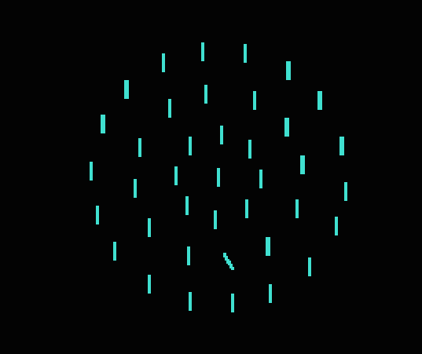

# Methods

## Experiment 1

### Participants

Twelve subjects participated in Experiment 1 (eight females; age range 20 and 33 years). All had normal or corrected-to-normal vision and naive to the purpose of the experiment. All participants gave informed consent prior to the experiment. The study was approved by the LMU Department of Psychology Ethics Committee and conformed to the Helsinki Declaration and Guidelines. 

### Apparatus and Stimuli

Stimuli were presented on a CRT monitor (screen resolution of 1600 x 1200 pixels; refresh rate 85 Hz;  display area of 39x29 cm). Participants were seated at a viewing distance of about 60 cm from the monitor.

Each stimulus display consisted of 39 bars, arranged around three concentric circles (see Figure \@ref(fig:display)). The distractors were turquoise-colored vertical bars. When a target was present, it was always on the middle circle. Targets were bars that differed from the the distractors in terms of either color or orientation, but never both. Color targets were either green or purple, while orientation targets were tilted $30^\circ$ clockwise or counterclockwise from the vertical. The search display subtended approximately $7.5^\circ$ x $7.5^\circ$ of visual angle and each individual bar had a size of approximately $0.5^\circ$ x $0.1^\circ$.

```{r display, fig.cap="Example of visual search display with an orientation target.", echo = FALSE}

```

### Procedure

The experiment consisted of 30 blocks of 40 trials, divided into three equally long sections with different proportions of target-present (and, correspondingly, target-absent) trials: 75% [target-absent: 25%], 50% [50%], and 25% [75%]. A text message informed participants about the current proportion of target-present trials at the start of each block. 
Alternating trial blocks presented exclusively color targets or orientation targets, on target-present trials.
The task was to report as quickly and accurately as possible whether a target was present or absent, using the left and right mouse buttons, respectively. Each trial started with the presentation of a fixation dot for 700-900 ms followed by the stimulus display, which was displayed until the participant responded. After the response, there was another 400-600 ms delay before the next trial started with the presentation of the fixation dot, so the total interval from response on one trial to presentation of the search display on the next trial was 1100-1500 ms.


## Experiment 2

### Participants

Twelve new participants took part in Experiment 2 (six females; age range 18 and 33 years). All had normal or corrected-to-normal vision and were naive as to the purpose of the experiment. All participants gave informed consent before the experiment.  The study was approved by the LMU Department of Psychology Ethics Committee and conformed to the Helsinki Declaration and Guidelines. 

### Apparatus and Stimuli

The same equipment and stimuli were used as in Experiment 1.

### Procedure

The procedure was the same to Experiment 1, except that instead of reporting whether a target was present or absent, participants had to report whether the target differed from distractors in terms of color or orientation. As in Experiment 1 there were three sections, each consisting of 10 blocks of 40 trials. Unlike in Experiment 1, a target was present on every trial and it was the proportion of color (or, respectively, orientation) targets that differed between the three sections, using the same ratios of 75% [orientation: 25%], 50% [50%], and 25% [75%]. Also unlike in Experiment 1, participants were not informed in advance of what that the proportion of color trials would be in any section of the experiment, nor were they informed that this proportion would differ across the different sections of the experiment.

## Experiment 3

### Participants

12 participants took part in Experiment 3 (six females; age range 23 and 33 years). All had normal or corrected-to-normal vision and were naive as to the purpose of the experiment. All participants gave informed consent before the experiment.  The study was approved by the LMU Department of Psychology Ethics Committee and conformed to the Helsinki Declaration and Guidelines. 

### Apparatus and Stimuli

The same equipment and stimuli were used as in Experiment 1.

### Procedure

As in Experiment 1, participants had to report on each trial whether a target was present or absent. However, the procedure differed from Experiment 1 in two important ways. First, in Experiment 3, the target-present/absent ratio was fixed at 50% throughout the whole experiment.  Second, color targets and orientation targets were interleaved within each block. We used a De Bruijn sequence generator [@brimijoin_patterned_2010; @de_bruijn_combinatorial_1946] to obtain a trial sequence where each of the four possible target types (i.e., purple, green, left-tilted, and right-tilted) were equally often followed by each target type (including itself) and were also equally often followed by a target-absent trial as by a target-present trial. Having such a trial sequence within each block requires 65 trials per block instead of 40 as in Experiments 1 and 2.

## Modelling

To find the model that best explained our data, we performed a factorial model comparison. Full descriptions of the four factors and their levels are given in the modelling section. Here we describe the general procedure used for the model fitting, which was the same for all models.

Each model consisted of an evidence accumulation model: either the LATER model or the DDM, and two updating rules, each of which specified how one parameter of the evidence accumulation model should change from trial to trial, based on the stimulus history. There was one such updating rule for the starting point and one for the evidence accumulation rate, and in each case one of the factor levels specified that no updating at all should take place. For the DDM, we used a closed-form approximation [@lee_bayesian_2006], 
adding a scaling parameter that determined the size of the random component of the drift diffusion model. This was necessary since our rule for updating the starting point made the scale non-arbitrary. 

Models were fitted using maximum likelihood, using the R function "constrOptim" to find minimum value of the negative log likelihood. Error trials and outliers were excluded from the calculation of the likelihood, but were included when implementing the updating rules. Outliers were defined as trials with reaction times more than 1.5 interquartile ranges below the mean or longer than 2 seconds.

To make sure we found the best possible fit for each combination of factor levels, we used an inner and an outer optimization process. The inner optimization process was run for each combination of parameters that was tested by the outer optimization process, to find the best possible values of the inner parameters for those values of the outer parameters. The inner parameters were the parameters of the evidence accumulation model itself, except for the non-decision time which was an outer parameter (because one level of one of the factors specified that the non-decision time should be fixed to zero). For the LATER model, the inner parameters were the starting point boundary separation, and the mean and standard deviation of the distribution for the rate. For the DDM, the inner parameters were the starting point boundary separation, the rate, and the scaling parameter. These parameters could differ between target absent trials, as well as between the two different target dimensions, meaning that there were nine inner parameters for Experiments 1 and 3 and six for Experiment 2 (where there were no target absent trials). The outer parameters were the non-decision time (when this wasn't fixed to zero), and 0 to 2 parameters for each updating rule (see the modelling section for details). This means that models could have 0 to 5 outer parameters in total depending on the factor levels.
